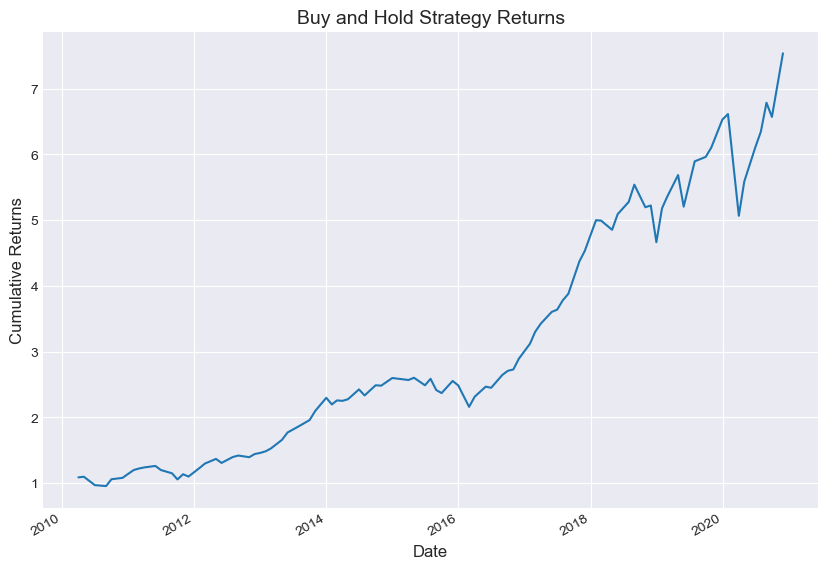

# 1. Read daily stocks data


```python
# Import pandas as pd
import pandas as pd

# Read the cryptocurrencies data stored in a csv file 
daily_stocks_data = pd.read_csv('stocks_data_2010_2020.csv', index_col = 0)

# Set the index to datetime 
daily_stocks_data.index = pd.to_datetime(daily_stocks_data.index)
daily_stocks_data.head()
```


<div>
<style scoped>
    .dataframe tbody tr th:only-of-type {
        vertical-align: middle;
    }

    .dataframe tbody tr th {
        vertical-align: top;
    }

    .dataframe thead th {
        text-align: right;
    }
</style>
<table border="1" class="dataframe">
  <thead>
    <tr style="text-align: right;">
      <th></th>
      <th>Amazon</th>
      <th>Apple</th>
      <th>Walmart</th>
      <th>Micron</th>
      <th>Bank of America</th>
      <th>Coca-Cola</th>
      <th>Boeing</th>
      <th>American Express</th>
    </tr>
    <tr>
      <th>Date</th>
      <th></th>
      <th></th>
      <th></th>
      <th></th>
      <th></th>
      <th></th>
      <th></th>
      <th></th>
    </tr>
  </thead>
  <tbody>
    <tr>
      <th>2009-12-31</th>
      <td>6.492372</td>
      <td>134.520004</td>
      <td>34.291534</td>
      <td>41.856789</td>
      <td>13.179974</td>
      <td>18.804321</td>
      <td>10.56</td>
      <td>40.802689</td>
    </tr>
    <tr>
      <th>2010-01-04</th>
      <td>6.593426</td>
      <td>133.899994</td>
      <td>34.630035</td>
      <td>43.441975</td>
      <td>13.731325</td>
      <td>18.817513</td>
      <td>10.85</td>
      <td>41.398109</td>
    </tr>
    <tr>
      <th>2010-01-05</th>
      <td>6.604825</td>
      <td>134.690002</td>
      <td>34.553879</td>
      <td>44.864773</td>
      <td>14.177655</td>
      <td>18.589882</td>
      <td>11.17</td>
      <td>40.985886</td>
    </tr>
    <tr>
      <th>2010-01-06</th>
      <td>6.499768</td>
      <td>132.250000</td>
      <td>35.112431</td>
      <td>46.225727</td>
      <td>14.343938</td>
      <td>18.583282</td>
      <td>11.22</td>
      <td>40.894283</td>
    </tr>
    <tr>
      <th>2010-01-07</th>
      <td>6.487752</td>
      <td>130.000000</td>
      <td>35.681915</td>
      <td>48.097031</td>
      <td>14.816527</td>
      <td>18.537094</td>
      <td>10.84</td>
      <td>40.917183</td>
    </tr>
  </tbody>
</table>
</div>


# 2. Convert daily to monthly data


```python
# Convert daily to monthly frequency
monthly_stocks_data = daily_stocks_data.asfreq('M')

# Drop NaN values
monthly_stocks_data = monthly_stocks_data.dropna()
monthly_stocks_data.head()
```


<div>
<style scoped>
    .dataframe tbody tr th:only-of-type {
        vertical-align: middle;
    }

    .dataframe tbody tr th {
        vertical-align: top;
    }

    .dataframe thead th {
        text-align: right;
    }
</style>
<table border="1" class="dataframe">
  <thead>
    <tr style="text-align: right;">
      <th></th>
      <th>Amazon</th>
      <th>Apple</th>
      <th>Walmart</th>
      <th>Micron</th>
      <th>Bank of America</th>
      <th>Coca-Cola</th>
      <th>Boeing</th>
      <th>American Express</th>
    </tr>
    <tr>
      <th>Date</th>
      <th></th>
      <th></th>
      <th></th>
      <th></th>
      <th></th>
      <th></th>
      <th></th>
      <th></th>
    </tr>
  </thead>
  <tbody>
    <tr>
      <th>2009-12-31</th>
      <td>6.492372</td>
      <td>134.520004</td>
      <td>34.291534</td>
      <td>41.856789</td>
      <td>13.179974</td>
      <td>18.804321</td>
      <td>10.56</td>
      <td>40.802689</td>
    </tr>
    <tr>
      <th>2010-03-31</th>
      <td>7.240106</td>
      <td>135.770004</td>
      <td>35.222775</td>
      <td>56.530022</td>
      <td>15.631181</td>
      <td>18.443974</td>
      <td>10.37</td>
      <td>42.683178</td>
    </tr>
    <tr>
      <th>2010-04-30</th>
      <td>8.043912</td>
      <td>137.100006</td>
      <td>39.371647</td>
      <td>56.389893</td>
      <td>15.613656</td>
      <td>17.924196</td>
      <td>9.35</td>
      <td>41.178520</td>
    </tr>
    <tr>
      <th>2010-06-30</th>
      <td>7.749377</td>
      <td>109.260002</td>
      <td>34.043896</td>
      <td>49.137108</td>
      <td>12.591907</td>
      <td>17.094294</td>
      <td>8.49</td>
      <td>37.116917</td>
    </tr>
    <tr>
      <th>2010-08-31</th>
      <td>7.489662</td>
      <td>124.830002</td>
      <td>34.189678</td>
      <td>48.159416</td>
      <td>10.918247</td>
      <td>19.058840</td>
      <td>6.46</td>
      <td>38.941193</td>
    </tr>
  </tbody>
</table>
</div>


# 3. Calculate monthly returns 


```python
# Calculate monthly percentage change
monthly_percent_change = monthly_stocks_data.pct_change()

# Drop NaN values
monthly_percent_change = monthly_percent_change.dropna()
monthly_percent_change.head()
```


<div>
<style scoped>
    .dataframe tbody tr th:only-of-type {
        vertical-align: middle;
    }

    .dataframe tbody tr th {
        vertical-align: top;
    }

    .dataframe thead th {
        text-align: right;
    }
</style>
<table border="1" class="dataframe">
  <thead>
    <tr style="text-align: right;">
      <th></th>
      <th>Amazon</th>
      <th>Apple</th>
      <th>Walmart</th>
      <th>Micron</th>
      <th>Bank of America</th>
      <th>Coca-Cola</th>
      <th>Boeing</th>
      <th>American Express</th>
    </tr>
    <tr>
      <th>Date</th>
      <th></th>
      <th></th>
      <th></th>
      <th></th>
      <th></th>
      <th></th>
      <th></th>
      <th></th>
    </tr>
  </thead>
  <tbody>
    <tr>
      <th>2010-03-31</th>
      <td>0.115171</td>
      <td>0.009292</td>
      <td>0.027157</td>
      <td>0.350558</td>
      <td>0.185980</td>
      <td>-0.019163</td>
      <td>-0.017992</td>
      <td>0.046087</td>
    </tr>
    <tr>
      <th>2010-04-30</th>
      <td>0.111021</td>
      <td>0.009796</td>
      <td>0.117789</td>
      <td>-0.002479</td>
      <td>-0.001121</td>
      <td>-0.028181</td>
      <td>-0.098361</td>
      <td>-0.035252</td>
    </tr>
    <tr>
      <th>2010-06-30</th>
      <td>-0.036616</td>
      <td>-0.203063</td>
      <td>-0.135319</td>
      <td>-0.128619</td>
      <td>-0.193532</td>
      <td>-0.046301</td>
      <td>-0.091979</td>
      <td>-0.098634</td>
    </tr>
    <tr>
      <th>2010-08-31</th>
      <td>-0.033514</td>
      <td>0.142504</td>
      <td>0.004282</td>
      <td>-0.019897</td>
      <td>-0.132915</td>
      <td>0.114924</td>
      <td>-0.239105</td>
      <td>0.049149</td>
    </tr>
    <tr>
      <th>2010-09-30</th>
      <td>0.167215</td>
      <td>0.258191</td>
      <td>0.054176</td>
      <td>0.088500</td>
      <td>0.052209</td>
      <td>0.063233</td>
      <td>0.116099</td>
      <td>0.067411</td>
    </tr>
  </tbody>
</table>
</div>


# 4. Calculate portfolio returns 


```python
# Calculate portfolio returns
portfolio_returns = monthly_percent_change.mean(axis=1)

# Calculate cumulative portfolio returns
cum_portfolio_returns = (portfolio_returns+1).cumprod()
```

# 5. Plot cumulative portfolio returns 


```python
# Import matplotlib as an alias plt and set the style
import matplotlib.pyplot as plt
%matplotlib inline
plt.style.use('seaborn-darkgrid')

# Plot cumulative strategy returns
cum_portfolio_returns.plot(figsize=(10, 7))

# Set title and labels for the plot
plt.title('Buy and Hold Strategy Returns', fontsize=14)
plt.xlabel('Date', fontsize=12)
plt.ylabel('Cumulative Returns', fontsize=12)
plt.show()
```


    

    


```python

```
